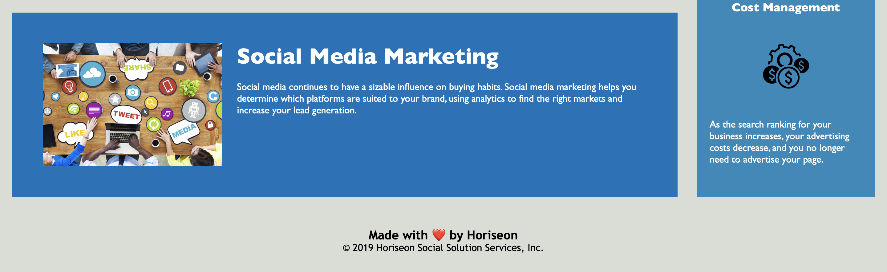

# Challenge-1-Code-Refactor


## Description

A marketing agency has hired me to refactor an exisiting site to make it more accessible. Some of these enhancements include:

- introduction of ```alt``` tags associated with images for vision impairment needs
- converted non-semantic HTML tags to semantic, increasing readability
- consolidated and re-organized CSS selectors for long-term sustainability


## Requirements

The business requirements asked for by the agency includes the following:

GIVEN a webpage meets accessibility standards
- WHEN I view the source code
  THEN I find semantic HTML elements
- WHEN I view the structure of the HTML elements
  THEN I find that the elements follow a logical structure independent of styling
  and positioning
- WHEN I view the image elements
  THEN I find accessible alt attributes
- WHEN I view the heading attributes
  THEN they fall in sequential order
- WHEN I view the title element
  THEN I find a concise, descriptive title


## Installation

N/A


## Deliverables

The webpage that was asked to be modified can be found at ```./Develop/index.html``` with an accompanying CSS file at ```./Develop/assets/css/style.css```.

The finished product can be found here: [https://japaricio98.github.io/Challenge-1-Code-Refactor/Develop/index.html](https://japaricio98.github.io/Challenge-1-Code-Refactor/Develop/index.html)

Screenshots of the finished product appear below. 





## Credits

Juan Aparicio


## License 

MIT License
